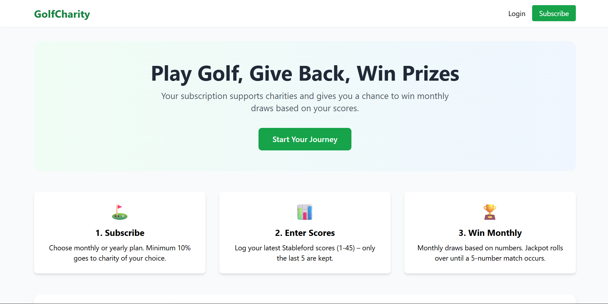
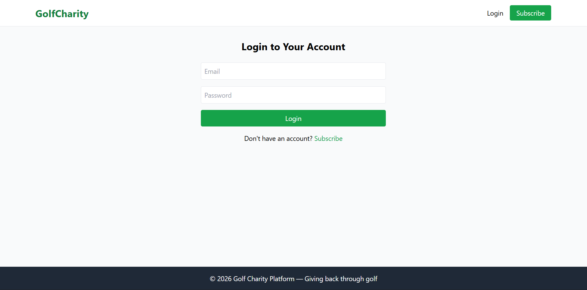
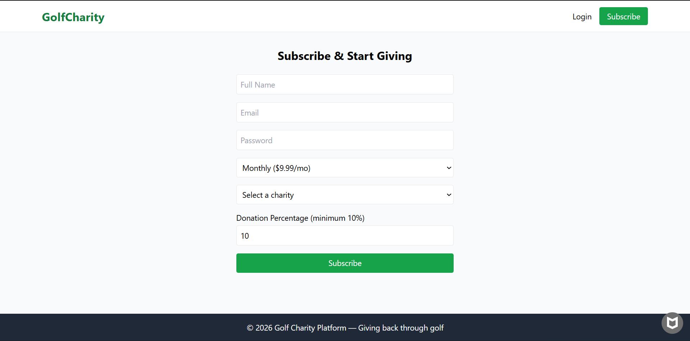
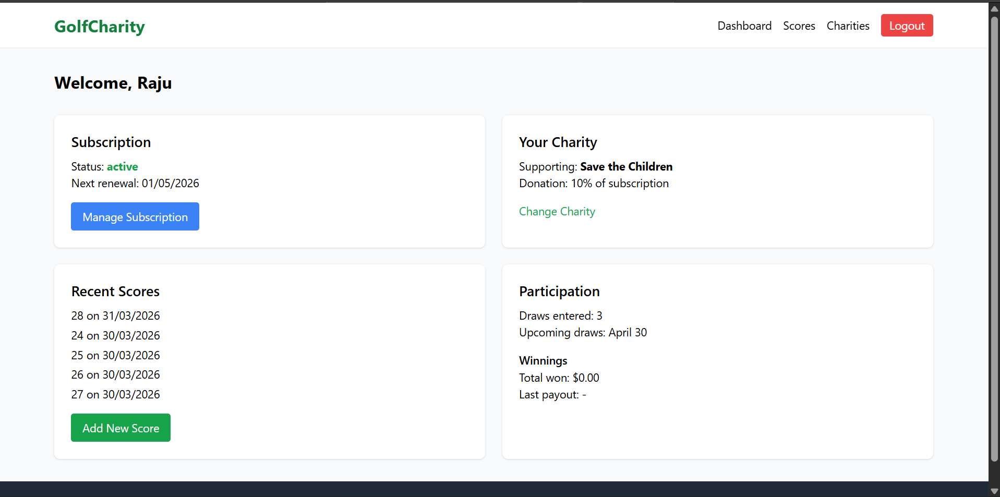
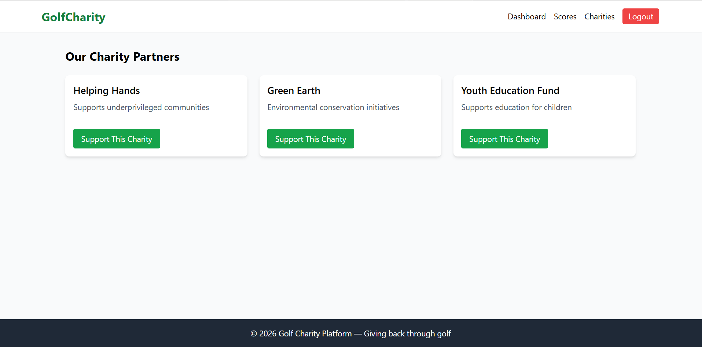
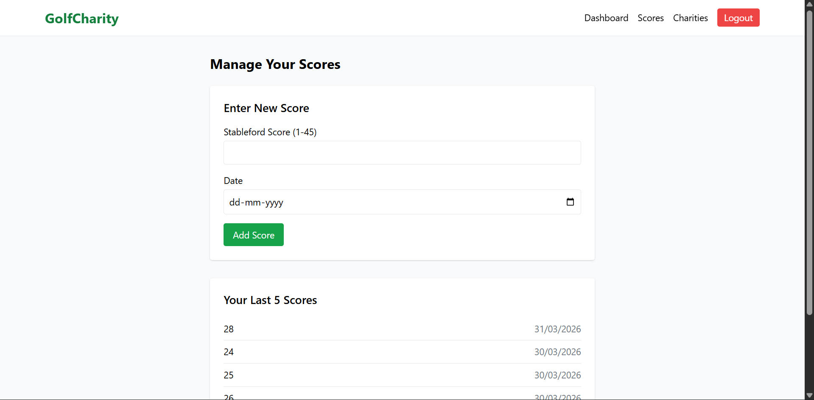
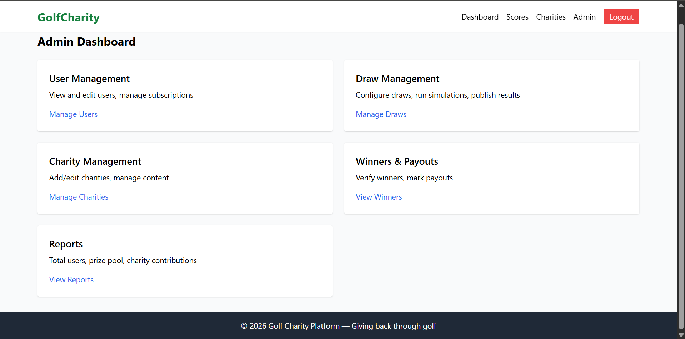

# Golf Charity Subscription Platform 🏌️‍♂️🤝

A full-stack web application for a golf charity subscription service. Users can subscribe, participate in draws, track scores, and support charities through golf-related activities.

## ✨ Features

- **User Authentication**: Secure login/register with JWT.
- **Subscription Management**: Manage recurring donations via Stripe.
- **Charity Dashboard**: View and support golf-related charities.
- **Score Tracking**: Log and view golf scores.
- **Admin Panel**: Manage users, draws, charities, and subscriptions.
- **Draws System**: Enter charity draws based on subscriptions.
- **Responsive UI**: Modern Tailwind CSS design.

## 📱 Screenshots









## 🏗️ Tech Stack

### Backend

- **Node.js / Express**: RESTful API server.
- **PostgreSQL**: Database (via pg).
- **Authentication**: JWT, bcrypt.
- **Payments**: Stripe.
- **Security**: Helmet, rate-limiting, CORS, validation.

### Frontend

- **React + Vite**: Fast SPA with HMR.
- **Tailwind CSS**: Utility-first styling.
- **React Context**: State management (auth).

## 🚀 Quick Start

### Prerequisites

- Node.js 18+
- PostgreSQL database
- Stripe account (test mode)

### Backend Setup

```bash
cd Golf_backend
cp .env.example .env  # Fill DB creds, JWT_SECRET, Stripe keys, etc.
npm install
npm run dev  # Starts on http://localhost:5000
```

### Frontend Setup

```bash
cd Golf_frontend
cp .env.example .env  # Set VITE_API_URL=http://localhost:5000/api
npm install
npm run dev  # Starts on http://localhost:5173
```

### Database

Update `Golf_backend/config/db.js` with your PostgreSQL connection string.

## 📁 Project Structure

```
.
├── Golf_backend/     # Express API
│   ├── controllers/  # Route handlers
│   ├── middleware/   # Auth, admin, error handling
│   ├── routes/       # API endpoints
│   ├── config/db.js  # DB connection
│   └── server.js     # Entry point
└── Golf_frontend/    # React app
    ├── src/components/ # UI components
    ├── src/pages/     # Page views
    ├── src/context/   # Auth context
    └── src/services/  # API calls
```

## 🔗 API Endpoints

- `POST /api/auth/register` - User signup
- `POST /api/auth/login` - User login
- `GET /api/charities` - List charities
- `POST /api/subscriptions` - Create subscription
- `GET /api/scores` - User scores
- Admin: `/api/admin/*`

## 🛡️ Security & Best Practices

- `.env` ignored via gitignore.
- Rate limiting, helmet, CORS configured.
- Input validation with express-validator.
- Production: Use HTTPS, strong secrets.

## 🤝 Contributing

1. Fork the repo.
2. Create feature branch: `git checkout -b feature/amazing-feature`.
3. Commit: `git commit -m 'Add amazing feature'`.
4. Push: `git push origin feature/amazing-feature`.
5. Open PR.

## 📄 License

MIT License.

---

**Built with ❤️ for golf lovers and charity!**
